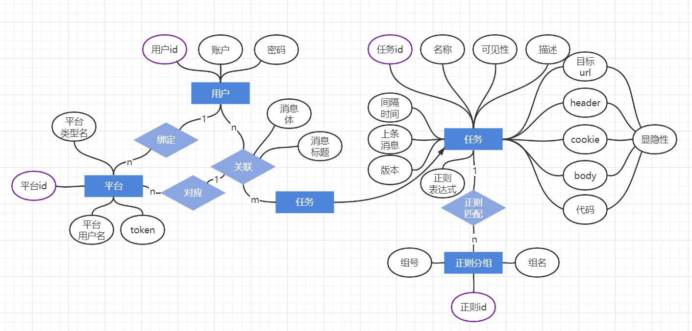
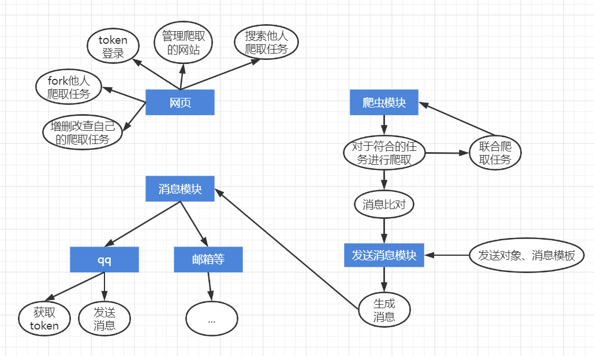

# 功能分析

- QQ方面
  - 通过命令获取个人配置网页, 自动带上参数(qq号+临时token)进行登录(需要账户表)
  - 进行消息推送的能力
  - (其他的奇怪功能(游戏等))
- 网页方面
  - 通过token登录账户(数据库)
  - 对订阅的网站进行增删改查的功能
  - (分享/查询订阅网站的功能)
  - (自动匹配正则表达式的功能-如果用amis的话不清楚要怎么做, 好像需要高js技术力)
- 爬虫方面
  - 通过httpx爬取数据库中的所有网址, 用re进行结果的处理并将结果存入数据库(需要协程)

# 构思

我们可以发现, 网页的增删改查和爬虫的爬取是这个项目的核心内容, 而qq只是提供一个进入网页的方法以及推送的渠道。因此, qq功能应该作为一个类似插件的东西。譬如以后可以加入微信的入口, 或是网页直接输入用户名密码登录, 或是邮件推送等。因此, 当爬虫调用推送时, 应当调用一个中间层, 而不是直接调用推送qq的函数。

网页应该是一个单独的进程/线程, 将增删改查直接向数据库里写。

爬虫每10分钟启动一次, 从数据库中取出网站列表进行爬取; 网站列表应当包括最后一条信息的哈希值以判断是否更新, 更新的话则写入新哈希&推送(maybe radis)。

# 具体设计

## 数据库

采用mysql、语句执行。具体参考[amis_helper](https://github.com/one-pyy/amis_helper/blob/main/amisHelper/sql/main.py)。

users存储自增的用户id、账号密码、token等。

tasks存储任务名称、目标网站、cookie、headers、代码等。

需求:

- 从用户拿到任务
- 从任务拿到平台
- 用户能设置平台的id

简单来说就是这样。

# 模块

